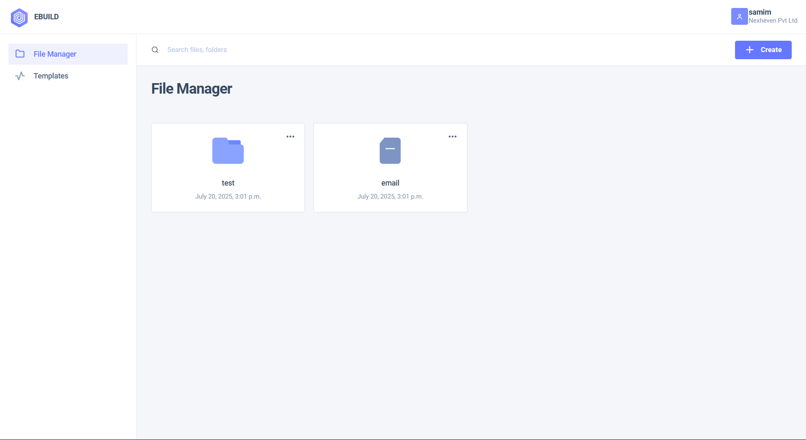
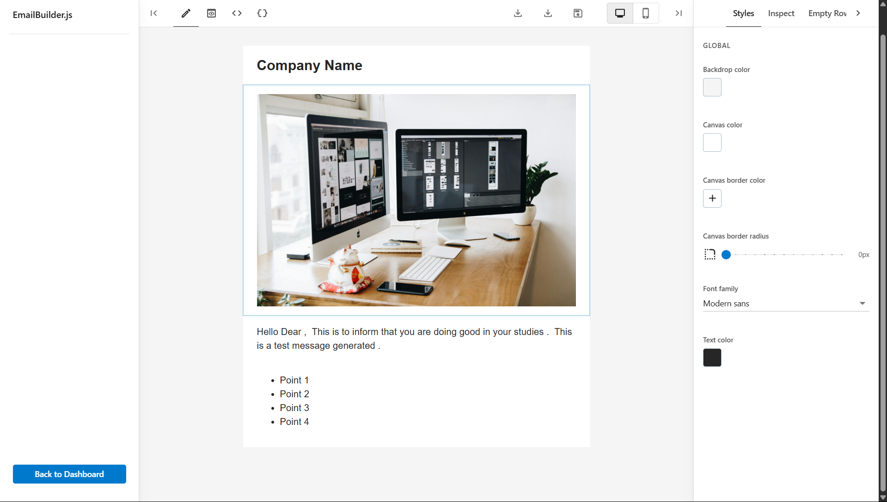

# 📧 eBuild – Drag & Drop Email Template Builder


eBuild is a full-stack, no-code platform built using **Django**, **React**, and **TypeScript** that empowers users to create responsive email templates via a **drag-and-drop interface**. React is compiled into a static build and integrated seamlessly with Django. Designed for simplicity and speed, users can export templates in **HTML format** without writing a single line of code.

---

| File Manager |
|-------------------|
|  |

---

## 🌟 Features

- 🚀 Drag & Drop Interface (powered by React)
- 🎨 Real-time Email Template Builder
- 💡 Export Email Template as HTML
- 💾 Templates stored in DB (editable anytime)
- 🌐 Fully integrated React frontend served by Django
- 🌀 TypeScript-based React UI for type safety and scalability

---

## 🛠️ Tech Stack

| Frontend | Backend |
|----------|---------|
| React (with Vite) | Django |
| TypeScript | Django REST Framework |
| Tailwind CSS | PostgreSQL / SQLite |

---

## 📸 Preview

| Email Builder |
|-------------------|
|  |

---

## 🚀 Getting Started

### 1. Clone the repository
```bash
git clone https://github.com/samim2904k/ebuild.git
cd ebuild
```

### 2. Backend Setup (Django)
```bash
python -m venv env
source env/bin/activate  # or `env\Scripts\activate` on Windows
pip install -r requirements.txt
python manage.py migrate
python manage.py runserver
```

### 3. Frontend Setup (React - optional if already built)
```bash
cd frontend
npm install
npm run build
# The build will be copied into Django's static files directory.
```

---

## 📦 Export Functionality

Once the email is created via the drag-and-drop builder, the **Export as HTML** feature allows you to download a clean and responsive email-ready HTML file.

---

## 🧠 How It Works

1. React UI allows block-based template creation.
2. Templates are saved and stored via Django backend.
3. Users can open, edit, preview, and export as raw HTML.

---

## 💡 Use Cases

- Marketing Campaigns
- Transactional Emails
- Newsletters
- Design Mockups

---

## 📁 Project Structure

```
ebuild/
├── backend/
│   ├── templates/
│   ├── static/
│   └── views.py, models.py
├── frontend/ (React + Vite + TS)
│   ├── src/
│   ├── dist/
│   └── index.html
├── db.sqlite3
└── manage.py
```

---


<p align="center"><i>Made with ❤️ by samim khan</i></p>

